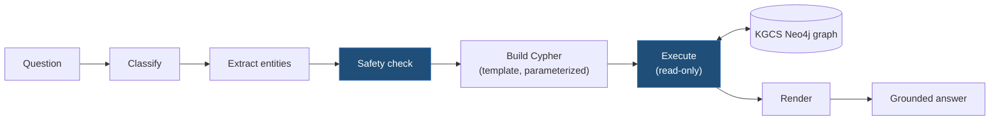

# kgcs-server

Serves grounded cybersecurity answers from the KGCS graph. Part of [Ariadna](../README.md).

## How it works

The AI layer never writes Cypher or invents facts — it classifies intent, extracts
entities, checks safety, and hands off to schema-driven agents that build and execute
parameterized templates only:



## Layout

- `agents/` — Systems, Offensive, Defensive agents (read-only, schema-driven Cypher templates) + `agents/shared/` (Neo4j client, response builder, confidence/risk scorers, schema validator, logging, types)
- `orchestrator/` — routing, execution, aggregation, mixed-intent handling + `api.py` (hardened HTTP API: `/query`, `/ask`; auth, rate limiting, timeouts, JSON logs)
- `ai/` — deterministic AI layer: intent classification, entity extraction, safety, response rendering (LLM never generates Cypher, never invents facts)
- `mcp/` — Model Context Protocol server exposing KGCS tools to any AI assistant (Roadmap v3 · F3, pending). Until it lands, the graph is queryable from Claude via the generic Neo4j Cypher MCP server — see the [MCP installation guide](docs/mcp/install-guide.md)
- `tools/` — `sync_spec.py` (pin materialization), `verify_schemas.py` (contract validation against the pinned spec), `smoke_test.py`
- `tests/` — cross-component integration tests and fixtures
- `spec/` — pinned `kgcs-spec` materialization (gitignored; see below)
- `Dockerfile`, `docker-compose.yml` — local/dev deployment stack

## Spec Pin

`SPEC_VERSION` pins the `kgcs-spec` release (currently **1.0.0**). Materialize with:

```bash
python tools/sync_spec.py   # or: python tools/sync_spec.py --url <kgcs-spec-url>
```

The script is idempotent: it wipes and rebuilds the gitignored `spec/` from the pinned tag (hand-edits cannot survive), records tag+commit in `spec/.pin`, and `--check` verifies the pin without syncing. CI runs it unconditionally before tests. `agents/shared/schema_validator.py` loads response/request contracts from `spec/contracts/`.

## MCP Access

The KGCS graph can be queried directly from Claude (Desktop / Cowork) through the Neo4j Cypher MCP server — useful for research sessions, peer review, and early users. Start with the [5-minute quickstart](docs/mcp/quickstart.md) ([Catalan version](docs/mcp/quickstart.ca.md)) — restore a ready-made dump and connect, no pipeline run needed. For anything the quickstart doesn't cover — building the graph from source instead of a dump, Neo4j Enterprise details, the full troubleshooting table — see the [install guide](docs/mcp/install-guide.md). Once connected, the [SOC investigation tutorial](docs/mcp/soc-investigation-tutorial.md) walks through four independent workflows — alert triage, vulnerability management, threat intel enrichment, incident response — and the [incident lifecycle tutorial](docs/mcp/incident-lifecycle-tutorial.md) follows a single major incident (a real, verified CVE-2021-44228/Log4Shell scenario) end to end through every NIST SP 800-61 phase, from Preparation to Post-Incident Activity, with verified prompts, Cypher, and output for analysts coming from Splunk/Nessus/SOAR/EDR.

## Rules

- Pins a released `kgcs-spec` version; response fields match its contracts exactly.
- Agents are read-only: parameterized Cypher templates only, validated by declared identity.
- Provenance stays source-separated; CVSS versions never merge.
- Traversals follow the causal chain; reverse traversal of existing edges allowed, shortcut edges never.
- Stop mixed-intent orchestration when an upstream agent fails.

## Status

Migrated from the seed repo (Release B baseline). **450/450 tests green in CI** (the remaining 18 of the historical 468 are ETL tests, in `kgcs-pipeline`), plus 25/25 JSON Schema contract checks (`tools/verify_schemas.py`) — `Test` workflow added 2026-07-27, run green on `main`. Pinned to `kgcs-spec` **v1.0.0**. Docs under `docs/` (architecture, agents, security, release history). **Public since 2026-07-27** (private preview launch); independent `gitleaks` scan clean.

`Build and Deploy` is gated to manual dispatch only (2026-07-27) — it builds+pushes Docker images to Azure infra that doesn't exist yet (`kgcs-infra` is dormant by design), so it no longer runs automatically on push.
