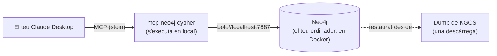

# KGCS MCP — Guia ràpida de 5 minuts (Private Preview)

Aquest és el camí curt: tenir un graf de KGCS funcionant en local i consultar-lo des
del teu propi Claude Desktop. Sense executar cap pipeline, sense hores esperant
descàrregues de dades — restaures un dump de base de dades ja fet i et connectes.

**A qui va dirigit.** Analistes de SOC que proven KGCS per primera vegada. Si alguna
cosa d'aquí sota no coincideix amb el que veus, o topes amb un error que no hi surt,
la referència completa — totes les opcions, tots els casos d'error — la tens a
[`install-guide.md`](install-guide.md). Aquesta pàgina només cobreix el camí que
necessites per a la private preview.

**Temps:** ~10-15 minuts, la major part esperant una descàrrega.



Tot el que surt en aquest diagrama s'executa **al teu propi ordinador**. No s'envia
res enlloc; no hi ha cap servidor compartit.

---

## Abans de començar — checklist

Necessites aquestes tres coses instal·lades. Si ja les tens, salta directament al pas 1.

- [ ] **Docker Desktop** — [docker.com/products/docker-desktop](https://www.docker.com/products/docker-desktop/). Instal·la'l, obre'l un cop i espera fins que digui "Docker Desktop is running" (una icona verda/balena a la barra de tasques o a la barra de menú).
- [ ] **`uv`** (executa el servidor MCP per tu — no l'has de cridar directament):
  - Windows (PowerShell): `winget install astral-sh.uv`
  - macOS: `brew install uv`
  - Linux: `curl -LsSf https://astral.sh/uv/install.sh | sh`
- [ ] **Claude Desktop**, ja instal·lat i amb sessió iniciada (probablement l'app on estàs llegint això).

✅ **Checkpoint:** Docker Desktop està obert i mostra un estat verd/en marxa. Si encara està arrencant, espera — no continuïs fins que estigui completament a punt.

---

## Pas 1 — Arrenca Neo4j

Obre un terminal (Windows: PowerShell o Git Bash; macOS/Linux: Terminal) i enganxa
això d'un sol cop. Substitueix `<choose-a-password>` per una contrasenya que
recordis — la necessitaràs de nou al pas 3.

```bash
docker run -d --name kgcs-neo4j \
  -p 7474:7474 -p 7687:7687 \
  -e NEO4J_AUTH=neo4j/<choose-a-password> \
  -e NEO4J_PLUGINS='["apoc"]' \
  -v kgcs_neo4j_data:/data \
  neo4j:5
```

✅ **Checkpoint:** obre [http://localhost:7474](http://localhost:7474) al navegador.
Hauries de veure la pantalla de login del Neo4j Browser. Inicia sessió amb l'usuari
`neo4j` i la contrasenya que has triat. Si la pàgina no carrega, espera 15 segons i
refresca — el contenidor triga un moment a arrencar.

---

## Pas 2 — Descarrega i restaura el graf

Descarrega el graf de KGCS ja construït (v1.0.0, ~812 MB):

**➡️ [Descarrega el dump (kgcs-dv-2026-07-27T10-51-43.dump, ~812 MB)](https://github.com/Ariadna-KGCS/kgcs-pipeline/releases/download/dataset-v1.0.0/kgcs-dv-2026-07-27T10-51-43.dump)**

Un cop descarregat, canvia el nom del fitxer a `neo4j.dump` i posa'l en una carpeta
buida pròpia (per exemple, una carpeta nova anomenada `kgcs-dump`). Després, al
terminal:

```bash
docker stop kgcs-neo4j

docker run --rm \
  -v kgcs_neo4j_data:/data \
  -v /path/to/kgcs-dump:/dumps \
  neo4j:5 \
  neo4j-admin database load neo4j --from-path=/dumps --overwrite-destination=true

docker start kgcs-neo4j
```

Substitueix `/path/to/kgcs-dump` per la carpeta real on has posat `neo4j.dump` (a
Windows, alguna cosa com `C:/Users/tu/kgcs-dump` — barres inclinades cap endavant
fins i tot a Windows, per a Docker).

✅ **Checkpoint:** al Neo4j Browser (encara obert des del pas 1), executa:

```cypher
MATCH (n) RETURN count(n);
```

Hauries d'obtenir **≈ 6.007.052** — si veus un número en milions, vas bé. Si veus
`0`, la restauració no s'ha aplicat — mira la secció "Troubleshooting" a
[`install-guide.md`](install-guide.md#7-troubleshooting).

---

## Pas 3 — Connecta Claude Desktop

A Claude Desktop: **Settings → Developer → Edit Config**. S'obre un fitxer anomenat
`claude_desktop_config.json` a l'editor de text per defecte. Afegeix-hi el bloc de
sota (si el fitxer ja té contingut, integra'l en lloc de substituir tot el fitxer):

```json
{
  "mcpServers": {
    "kgcs-neo4j": {
      "command": "uvx",
      "args": ["mcp-neo4j-cypher@0.6.0", "--transport", "stdio"],
      "env": {
        "NEO4J_URI": "bolt://localhost:7687",
        "NEO4J_USERNAME": "neo4j",
        "NEO4J_PASSWORD": "<la contrasenya que has triat al pas 1>",
        "NEO4J_DATABASE": "neo4j",
        "NEO4J_READ_ONLY": "true"
      }
    }
  }
}
```

Desa el fitxer i **tanca Claude Desktop del tot i torna'l a obrir** (no n'hi ha prou
amb tancar la finestra — surt de l'aplicació des de la icona de la barra de tasques
o de menú).

✅ **Checkpoint:** comença un xat nou i busca una petita icona d'eines/endoll a prop
de la caixa de missatge, o pregunta a Claude "quines eines MCP tens?". Hauries de
veure `read_neo4j_cypher` i `get_neo4j_schema` a la llista. Si no hi surten, mira la
fila "Tools don't appear" a [`install-guide.md`](install-guide.md#7-troubleshooting)
— gairebé sempre és un problema de PATH amb `uvx`, i l'arreglo és canviar una línia
de la configuració.

---

## Pas 4 — Fes-li una pregunta real a Claude

Al mateix xat, pregunta:

> Fent servir el graf de KGCS, mostra'm la cadena causal completa des de
> CVE-2021-44228 fins a qualsevol tècnica d'ATT&CK que habiliti.

Si Claude respon amb una cadena com `CVE-2021-44228 → CWE-917 → CAPEC-242 →
T1059`, tot funciona de cap a cap.

---

## Ja ho tens configurat — ara prova-ho amb un cas real

La guia ràpida s'atura aquí a propòsit. Per veure com és KGCS de veritat en un torn
de SOC — triatge d'alertes, priorització de vulnerabilitats, enriquiment de threat
intel, i un recorregut complet d'un incident — vés a:

- **[Tutorial d'investigació SOC](soc-investigation-tutorial.md)** — els quatre moments en què un analista de SOC obre KGCS durant un torn, amb els prompts exactes.
- **[Tutorial del cicle de vida d'un incident](incident-lifecycle-tutorial.md)** — un sol incident (Log4Shell) seguit a través de les fases del NIST SP 800-61.

Prova de replicar-ne un contra el teu propi graf — és la millor manera de jutjar si
KGCS és útil per a la teva feina.

---

## Alguna cosa ha fallat / necessites més detall?

Aquesta pàgina només cobreix el camí ràpid. Per construir el graf des de les fonts en
lloc d'un dump, per executar-ho amb Neo4j Enterprise, o per la taula completa de
troubleshooting, mira [`install-guide.md`](install-guide.md).
