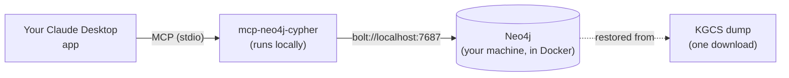

# KGCS MCP — 5-Minute Quickstart (Private Preview)

This is the short path: get a KGCS graph running locally and query it from your own
Claude Desktop app. No pipeline runs, no waiting hours for data downloads — you
restore a ready-made database dump and connect to it.

**Who this is for.** SOC analysts trying KGCS for the first time. If something below
doesn't match what you see, or you hit an error not covered here, the full reference
— every option, every failure mode — lives in [`install-guide.md`](install-guide.md).
This page only covers the one path you need for the private preview.

**Time:** ~10-15 minutes, most of it waiting for a download.



Everything in this diagram runs **on your own machine**. Nothing is sent anywhere;
there is no shared server.

---

## Before you start — checklist

You'll need these three things installed. If you already have them, skip ahead.

- [ ] **Docker Desktop** — [docker.com/products/docker-desktop](https://www.docker.com/products/docker-desktop/). Install it, then open it once and wait until it says "Docker Desktop is running" (a green/whale icon in your system tray or menu bar).
- [ ] **`uv`** (runs the MCP server for you — you won't call it directly):
  - Windows (PowerShell): `winget install astral-sh.uv`
  - macOS: `brew install uv`
  - Linux: `curl -LsSf https://astral.sh/uv/install.sh | sh`
- [ ] **Claude Desktop**, already installed and signed in (the app you're reading this in, most likely).

✅ **Checkpoint:** Docker Desktop is open and shows a running/green status. If it's still starting up, wait — don't continue until it's fully ready.

---

## Step 1 — Start Neo4j

Open a terminal (Windows: PowerShell or Git Bash; macOS/Linux: Terminal) and paste this
in one go. Replace `<choose-a-password>` with any password you'll remember — you'll
need it again in Step 4.

> **Neo4j itself doesn't need a separate install.** There's no app to download beyond
> Docker — the command below pulls the official `neo4j:2026.05-community` image the first time you run
> it (~1-2 minutes, depends on your connection) and runs it as a container. That's the
> whole "installation."

```bash
docker run -d --name kgcs-neo4j \
  -p 7474:7474 -p 7687:7687 \
  -e NEO4J_AUTH=neo4j/<choose-a-password> \
  -e NEO4J_PLUGINS='["apoc"]' \
  -v kgcs_neo4j_data:/data \
  neo4j:2026.05-community
```

✅ **Checkpoint:** open [http://localhost:7474](http://localhost:7474) in your browser.
You should see the Neo4j Browser login screen. Log in with username `neo4j` and the
password you chose. If the page doesn't load, wait 15 seconds and refresh — the
container takes a moment to start.

---

## Step 2 — Download and restore the graph

Download the pre-built KGCS graph (v1.0.0, ~812 MB):

**➡️ [Download the dump (kgcs-dv-2026-07-27T10-51-43.dump, ~812 MB)](https://github.com/Ariadna-KGCS/kgcs-pipeline/releases/download/dataset-v1.0.0/kgcs-dv-2026-07-27T10-51-43.dump)**

Once downloaded, rename the file to `neo4j.dump` and put it in its own empty folder
(e.g. a new folder called `kgcs-dump`). Then, in your terminal:

```bash
docker stop kgcs-neo4j

docker run --rm \
  -v kgcs_neo4j_data:/data \
  -v /path/to/kgcs-dump:/dumps \
  neo4j:2026.05-community \
  neo4j-admin database load neo4j --from-path=/dumps --overwrite-destination=true

docker start kgcs-neo4j
```

Replace `/path/to/kgcs-dump` with the actual folder where you put `neo4j.dump`
(on Windows, something like `C:/Users/you/kgcs-dump` — forward slashes even on
Windows, for Docker).

✅ **Checkpoint:** in the Neo4j Browser (still open from Step 1), run:

```cypher
MATCH (n) RETURN count(n);
```

You should get **≈ 6,007,052** — if you see a number in the millions, you're good.
If you see `0`, the restore didn't apply — check the "Troubleshooting" section in
[`install-guide.md`](install-guide.md#7-troubleshooting).

---

## Step 3 — Connect Claude Desktop

In Claude Desktop: **Settings → Developer → Edit Config**. This opens a file called
`claude_desktop_config.json` in your default text editor. Add the block below (if the
file already has content, merge it in rather than replacing the whole file):

```json
{
  "mcpServers": {
    "kgcs-neo4j": {
      "command": "uvx",
      "args": ["mcp-neo4j-cypher@0.6.0", "--transport", "stdio"],
      "env": {
        "NEO4J_URI": "bolt://localhost:7687",
        "NEO4J_USERNAME": "neo4j",
        "NEO4J_PASSWORD": "<the password you chose in Step 1>",
        "NEO4J_DATABASE": "neo4j",
        "NEO4J_READ_ONLY": "true"
      }
    }
  }
}
```

Save the file, then **fully quit Claude Desktop and reopen it** (closing the window
is not enough — quit it from the tray/menu bar icon too).

✅ **Checkpoint:** start a new chat and look for a small tools/plug icon near the
message box, or ask Claude "what MCP tools do you have?". You should see
`read_neo4j_cypher` and `get_neo4j_schema` listed. If you don't, see the
"Tools don't appear" row in [`install-guide.md`](install-guide.md#7-troubleshooting)
— it's almost always a PATH issue with `uvx`, and the fix is a one-line config change.

---

## Step 4 — Ask Claude a real question

In the same chat, ask:

> Using the KGCS graph, show me the full causal chain from CVE-2021-44228 to any
> ATT&CK techniques it enables.

If Claude comes back with a chain like `CVE-2021-44228 → CWE-917 → CAPEC-242 →
T1059`, everything is working end to end.

---

## You're set up — now try it on something real

The quickstart stops here on purpose. For what KGCS actually looks like in a SOC
shift — alert triage, vuln prioritization, threat-intel enrichment, and a full
incident walkthrough — go to:

- **[SOC investigation tutorial](soc-investigation-tutorial.md)** — the four moments a SOC analyst opens KGCS during a shift, with exact prompts.
- **[Incident lifecycle tutorial](incident-lifecycle-tutorial.md)** — a single incident (Log4Shell) followed through NIST SP 800-61 phases.

Try replicating one of them against your own graph — that's the best way to judge
whether KGCS is useful for your workflow.

---

## Something went wrong / need more detail?

This page only covers the fast path. For building the graph from source instead of a
dump, running on Neo4j Enterprise, or the full troubleshooting table, see
[`install-guide.md`](install-guide.md).
